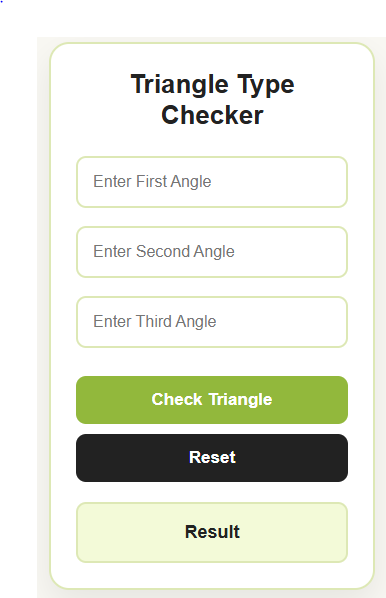
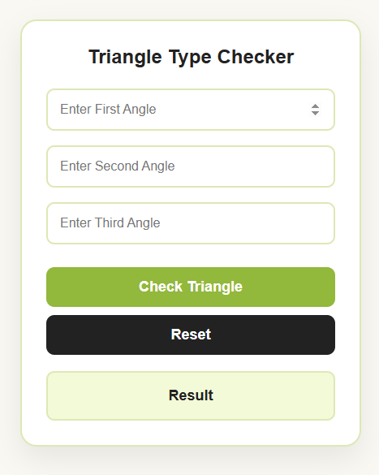

<p align="center">
  
</p>

<h1 align="center">Triangle Analyzer</h1>

<p align="center">
A simple web application that validates three sides and identifies whether the triangle is <b>Equilateral</b>, <b>Isosceles</b>, or <b>Scalene</b>. Built with HTML, CSS, and JavaScript while practicing core programming logic.
</p>

<p align="center">
  <a href="https://playwithangle.netlify.app/">Live Demo</a> •
  <a href="https://github.com/chitrangna-dev/triangle-analyzer">Source Code</a>
</p>

---

## Preview

<p align="center">
  
</p>

---

## Demo

<p align="center">
  
</p>

---

## Features

* Validates whether the entered sides can form a triangle.
* Classifies triangles as Equilateral, Isosceles, or Scalene.
* Displays clear messages for invalid inputs.
* Responsive interface for desktop and mobile devices.
* Instant result without reloading the page.
* Clean and beginner-friendly JavaScript implementation.

---

## Built With

* HTML5
* CSS3
* JavaScript (ES6)

---

## Getting Started

Clone the repository:

```bash
git clone https://github.com/YOUR_USERNAME/triangle-analyzer.git
```

Move into the project folder:

```bash
cd triangle-analyzer
```

Open `index.html` in your preferred web browser.

---

## Why I Built This

This project was created to strengthen my understanding of JavaScript conditionals, input validation, and DOM manipulation while building a clean and responsive user interface.

---

## Author

**Chitrangna**

Learning Web Development one project at a time.

If you have suggestions or feedback, feel free to open an issue or submit a pull request.

---

## License

This project is available under the MIT License.
